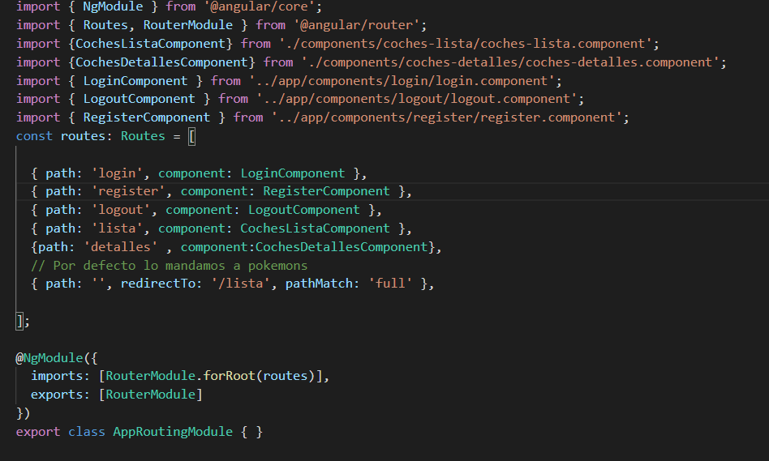
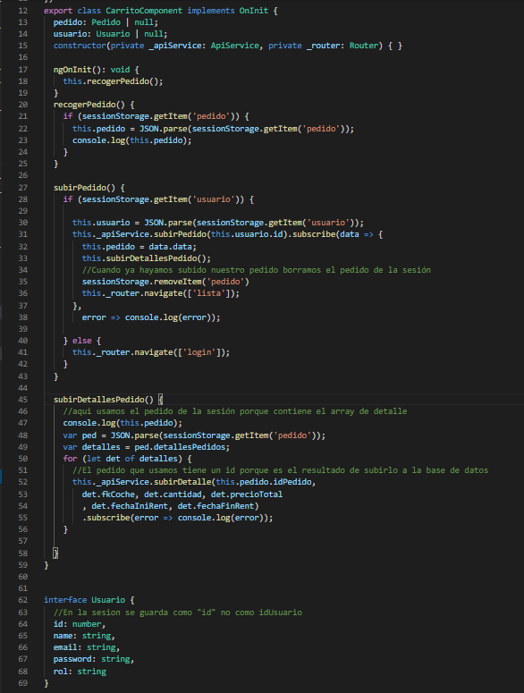
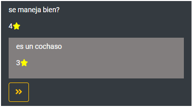
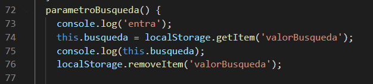

# Proyecto (Pagina de Alquiler de coches)
Se pretende crear una web de alquiler de coches en la cual los usuarios puede alquilar tanto coches normales como deportivos .Los usuarios también podrán comentar lo que les ha parecido ese coche y puntuar .

**Índice**
1. [Manual de uso](#id1)
2. [Requisitos del sistema](#id5)
3. [Memoria 15/04](#id2)
4. [Memoria 04/05](#id3)
5. [Memoria 29/05](#id4)
6. [Experiencias aprendidas](#id6)
7. [Conclusiones](#id7)
8. [Costes Monetarios](#id8)
9. [Cumplimiento de alcance](#id9)
10. [Cumplimiento de tiempo](#id10)
11. [Descripción del producto final](#id11)
## Tecnoligas usuadas

* Laravel (PHP) : usado como una api en  la parte de backend 
* Angular (Js): usado para la parte del cliente 
* Boostrap y Material :Usado para el Front
* Mysql : como lenguaje de base de datos
* phpMyAdmin : como gestor de base de datos
* VsCode : Editor de codigo

## Manual de uso

>**Arrancamos los servicios Apache y Mysql en xampp y en Mysql clickamos en 'Admin'**

    
>**Para abrir xampp en la maquina entregada ejecutar el siguiente script y ejecutar los  comandos que vienen despues :**
    >Password Maquina Virtual = 1q2w3e4r

>**Luego cogemos el Script alquiler_coches.sql y lo importamos**

>**Abirmos el proyecto apiCoche y ejecutamos el siguiente (php artisan serve) comando para arrancar la API** 

>**Por ultimo abrimos el proyecto de angular alquilerCochesNg y ejecutamos el siguiente comando (npm start)**

## Requisitos del sistema
* NodeJS y NPM
* Composer con laravel
* Mysql y Phpmyadmin

## Memoria 15/04
>**Usuarios**
* [Admin] = pablo , '1q2w3e4r'
* [usuario] = anna , '1q2w3e4r'

* Creamos un proxy para saltarnos el CORS que puede tener nuestra api y que nos puede generar problemas
    

* Introducimos los datos recogidos por la api en una card para mejorar el front:
    

* creamos las rutas en el fichero app-routin.modules.ts   
    

* Cambiamos el estilo del navbar y le introducimos tres links (login ,sign in , about us):
    

* El login funciona correctamente , cuando los logeamos recibimos el objeto del usuario en el que hemos entrado  que se guardará en sesion  , y nos reedirigirá al home:
    

* si el usuario es 'Admin' le saldrán dos botones uno para editar y otro para eliminar (Por ahora funciona el eliminar):   
       

* Cuando clicamos en un vehiculo nos saldra los detalles de este:
     

    

## Memoria 04/05
* Introducimos cierta seguridad en la aplicación , para ello hacemos lo siguiente:
    * Creamos dos middleware en la api uno para que en ciertas partes se tengan que authentificar y otro  para verificar el rol del usuario
        > middleware para la authentificación
        

        > middleware para la verificación de los roles
        
    * Para usarlo desde nuestro cliente debemos recoger el token en el momento que nos logueamos :
        > recogemos el token y lo guardamos en el localStorage para usarlo mas adelante
        
        

    * Por ultimo en el fichero donde hacemos nuestras consultas a la API introducimos el token en el header de la siguiente manera:
        >Introducimos el token en el header:
        
        
        >Usamos el header para nuestras consultas:
        

* El logout funciona correcatemente lo que hace es eliminar todas las sesiones del localStorage y el sesionStorage y reedirigirte al home:

    

* El register funciona correctamente:
    > Metodo que llamamos desde el front
    

    > Metodo para realizar la consulta en el fichero de consultas:
     

* Mejoramos he hicimos usable la parte de detalles (cuando clicamos un card de un vehiculo):
    > En este apartado puedes seleccionar la cantidad de vehiculos para alquilar y desde que dia hasta que dia lo quieres
    
    > Cogemos todos los datos que haya introducido y los metemos en un obejto de 
    > DetallePedidos que a su vez irá en un array de Pedidos .Por ultimo lo subimos al localStorage .
    > Por cada nuevo detalle verificamos si hay algun localStorage de pedidos creados en caso de no creamos uno
    

    * Para poder subir nuestros pedidos creamos un componenete de carrito donde se visualizaran nuestros pedidos que hayamos hecho y con un boton para poder subirlos a la base de datos
    

    > Recogemos los pedidos del localStorage 
    

    > y los subimos a la base de datos
    

* Creamos el componente para subir vehiculos nuevos "Solo disponible para usuarios ADMIN"
    >Para crear este stepper de material importamos el modulo "import {MatStepperModule} from '@angular/material/stepper';" y "import { FormsModule , ReactiveFormsModule  } from  '@angular/forms';" para introducir  y recoger los datos del stepper
    

    >Creamos un nuevo FormGroup para recoger los datos
    

    > Recogemos los datos que nos han enviado:
    

    > Por ultimo los enviamos a la base de datos:
    

* Por ultimo Creamos el componente de actualizar Coches "Solo disponible para usuarios ADMIN"
    >Introducimos el Coche modificado en el metodo para subir en la api
    
    > Y Actualizamos el coche en la base de datos
    

    

## Memoria 29/05

* Introducimos un nuevo componente de comentarios en la parte de detalles:
    
   

  >En este componenete podemos introducir comentarios sobre el producto y puntuar sobre el
  > , lo unico que tenemos que hacer es escribir el comentario y si queremos pulsar la estrella que queramos y enviar

    * Lo primero que hace este componente es cargar los comentarios por id de vehiculo
    
    

    * Luego si queremos podemos crear un nuevo comentario o responder a los que estan en la lista de comentarios
    >Verificamos si hay algun usuario logeado en caso negativo se le reedigira al login para que se logee y comente
    

    >Para responder el comentario usamos este mismo metodo solo que añadiendo la clave foranea de la pregunta
    

    * A lahora de volcarlo en la vsita miraremos si hay algun comentario con el id de la pregunta y la colocaremos ahi
    
    

    * [ Privilegios ROOT ]: el usuario root al igual que los demas usuarios podra comentar y responder , pero también podra borrar comentarios
    >Si clickamos el boton rojo borraremos el comentario

    
    

* Introducimos un buscador por marcas:
>Aquí introduciremos el nombre de la marca que queramos buscar y nos saldrá
  

  >Por ejemplo si introducimos "honda" nos saldran los honda
  

   * Creamos un localStorage con lo que pusimos en la busqueda y en el componente lista lo recogemos

  

   * Y con lo anterior hacemos una petición a la base de datos que recoja todos los coches con esa marca
  

* Mejoramos el aspecto del carrito:
>Ahora nos muestran datos como el coste total las fechas y se pueden eliminar de la cesta
     

  * Cuando no aparece ningun coche se ve esto:
    

* Tenemos una nueva sección para el usuario logeado que nos mostrará todos nuestros pedidos:
>Nos enseña la fecha del pedido junto con su id
  

  * Si clickamos en una tarjeta de pedidos nos enseñaran los detalles del pedido :
    >Nos enseñará la fecha inicial y final del alquiler mas el numero del pedido
  

  * Por ultimo si clicamos en una de las tarjetas de los detalles no aparecerá el vehiculo que hemos alquilado con sus datos
                   

## Experiencias aprendidas

* He aprendido a relacionar de una manera limipa y correcta el cliente con el servidor .Pudiendo usar el servidor como api Rest para que en futuros proyectos se pueda exportar los datos de la api a cualquier tipo de cliente de manera sencilla y limpia. También he aprendido a usar el freamwork Angular de manera mas eficaz . Y a manejar los tokens entre cliente y servidor.

## Conclusiones

* Las conclusiones sobre este proyecto fueron que realmente no hacia falta usar una api en laravel y un cliente en angular para hacer esta pagina web ,por el otro lado ,
al usar estas tecnologias he aprendido a relacionar correctamente cliente y servidores como en las aplicaciones modernas. Y para futuras aplicaciones saber como consumir las apis en distintos frameworks de cliente ya que en framework de angular es muy parecido a otros.

## Costes monetarios

* Por lo general se usaron tecnologias totalmente gratuitas. El unico coste seria si habria que pasar la app a un servidor publico.

## Cumplimientos de alcances

* Se cumplieron todos los objetivos salvo : subir imagenes al servidor y crear un buen filtro para filtrar coches por todos sus atributos. El uso de la API me dificulataba hacer estas dos ultimas tareas .

## Cumplimientos de tiempo

* Por lo general se cumplieron todos los plazos.

## Descripción del producto final

* El producto es una pagina de alquiler de coches en la que los usuarios pueden alquilar coches por un determinado tiempo y podrán comentar sobre los coches de la pagina.
 Tambiñen los usuarios de tipo ADMIN podrán introducir nuevos coches , actualizarlos y borrarlos y por ultimo también podrán borrar los comentarios.